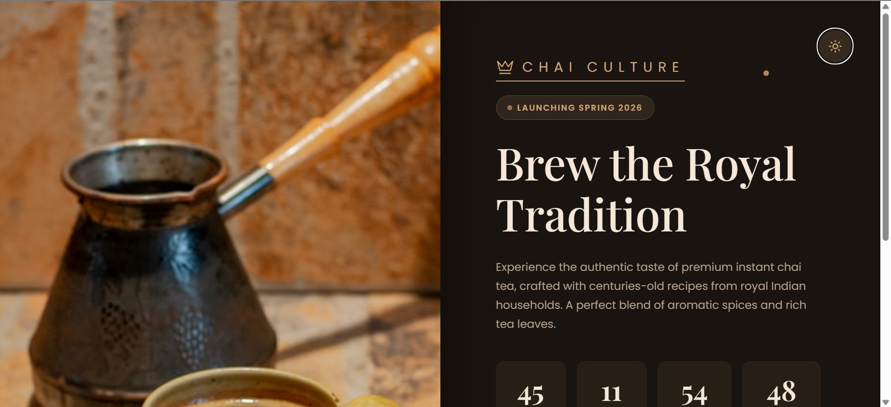
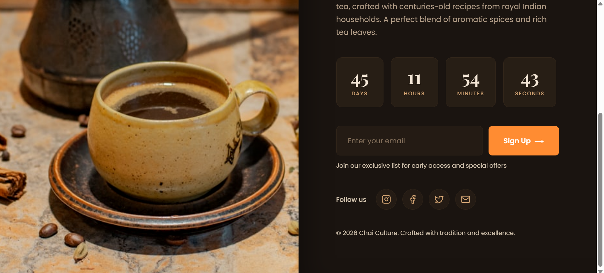
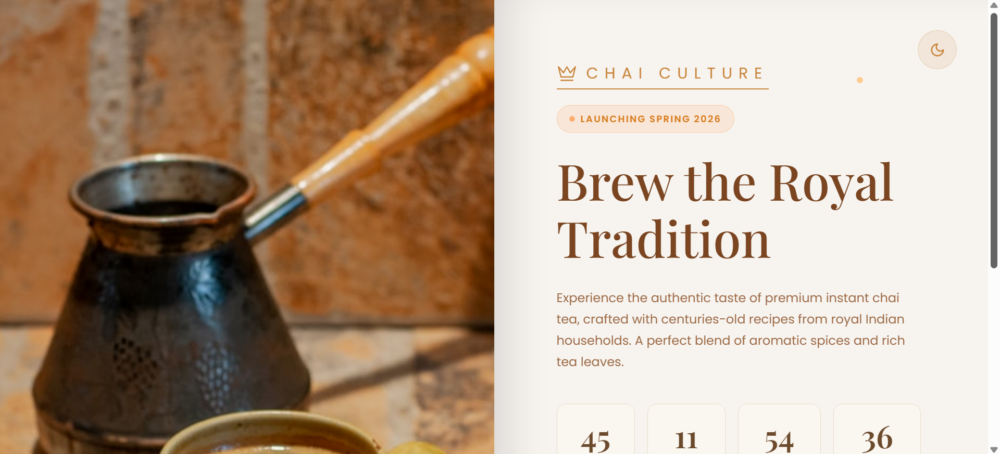
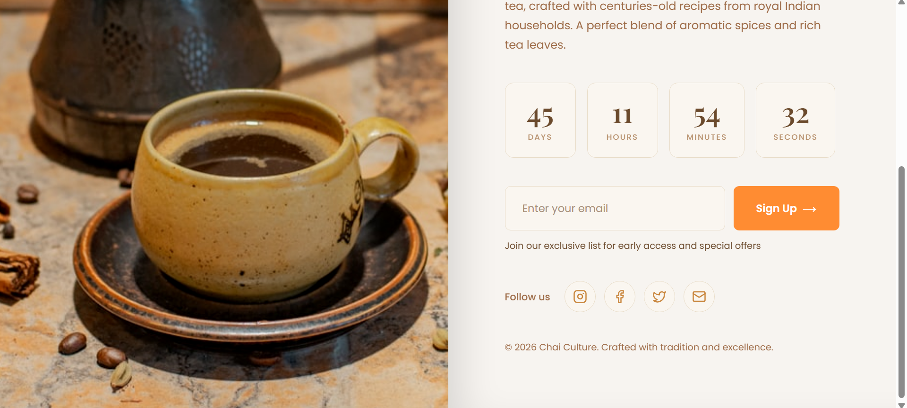

# Royal Chai - Coming Soon Landing Page

A beautiful, responsive coming soon landing page for Royal Chai, a premium instant chai tea brand. Features a split-screen design with an elegant dark/light theme toggle and countdown timer.

## Features

- **Dual Theme Support**: Seamless toggle between dark and light themes
- **Responsive Design**: Fully optimized for all devices from 4K monitors to small mobile phones (320px+)
- **Countdown Timer**: Live countdown to launch date (Spring 2026)
- **Email Notification**: Email capture form for launch notifications
- **Social Media Links**: Instagram, Facebook, Twitter, and Email integration
- **Smooth Animations**: Elegant fade-in and slide animations throughout
- **Split-Screen Layout**: Image section with gradient shadow merging into content section

## Live Demo

🔗 **[View Live Demo](https://chai-culture-seven.vercel.app/)**

### Deployment Option Considered
- **Vercel**: `vercel deploy`

## Screenshots

### Dark Theme

*Desktop view with dark theme showing the full landing page*


*Dark theme with email form and social links visible*

### Light Theme

*Desktop view with light theme showing elegant color palette*


*Light theme with all interactive elements*


## Tech Stack

- **React** (with Hooks)
- **Vite** (Build tool)
- **Lucide React** (Icons)
- **CSS3** (Custom styling with animations)

## Project Structure

```
├── src/
│   ├── App.jsx          # Main component with all functionality
│   ├── App.css          # Complete styling and responsive design
│   ├── index.css        # Global reset styles
│   └── main.jsx         # React entry point
└── README.md
```

## Installation & Setup

1. **Clone the repository**
   ```bash
   git clone https://github.com/preranah7/Chai-Culture
   cd royal-chai-landing
   ```

2. **Install dependencies**
   ```bash
   npm install
   ```

3. **Run development server**
   ```bash
   npm run dev
   ```

4. **Build for production**
   ```bash
   npm run build
   ```

## Dependencies

```json
{
  "react": "^18.x.x",
  "react-dom": "^18.x.x",
  "lucide-react": "^0.263.1"
}
```

## Key Design Elements

### Color Palette

**Dark Theme:**
- Background: `#1a1410`
- Primary Text: `#f5e8d8`
- Accent: `#d4a574`
- Button: `#ff8c32`

**Light Theme:**
- Background: `#f7f4f0`
- Primary Text: `#7a4520`
- Accent: `#c9863d`
- Button: `#ff8c32`

### Typography
- **Headings**: Playfair Display (serif)
- **Body**: Poppins (sans-serif)

## Responsive Breakpoints

- **Extra Large Desktops**: 1400px+
- **Large Desktops**: 1200px - 1399px
- **Standard Laptops**: 992px - 1199px
- **Tablets Landscape**: 768px - 991px
- **Tablets Portrait**: 600px - 767px
- **Mobile Landscape**: 480px - 599px
- **Mobile Portrait**: 375px - 479px
- **Small Mobile**: 320px - 374px
- **Extra Small**: <320px

## Components Breakdown

### App.jsx
- **State Management**: 
  - `showModal`: Controls modal visibility
  - `isDark`: Theme toggle state
  - `email`: Email input value
  - `timeLeft`: Countdown timer state

- **Effects**:
  - Countdown timer interval (updates every second)

- **Functions**:
  - `handleSocialClick()`: Opens modal for social links
  - `handleNotify()`: Handles email form submission
  - `toggleTheme()`: Switches between dark/light themes

### Key Sections
1. **Image Section**: Full-bleed background image
2. **Content Section**: Logo, badge, heading, description, countdown, form, social links, footer
3. **Theme Toggle**: Floating button for theme switching
4. **Modal**: Notification for features in development

## License

This project is created for educational/portfolio purposes.

## Credits

- **Design**: Custom design for Royal Chai brand
- **Icons**: Lucide React
- **Font**: Google Fonts (Playfair Display, Poppins)
- **Image**: Unsplash

---

**Created with ❤️ for Chai Culture - Brew the Royal Tradition**